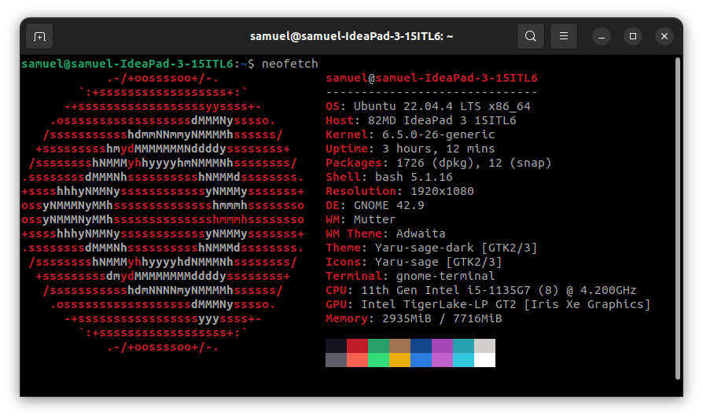
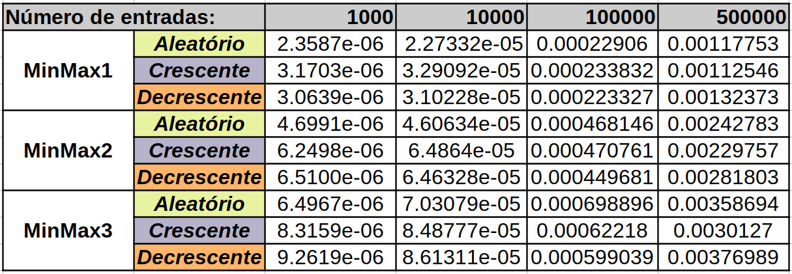
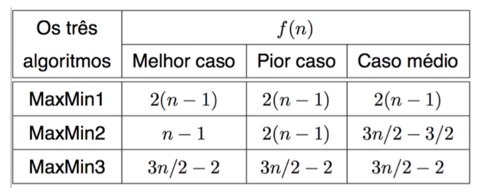

           d8888 8888888888 8888888b.   .d8888b.  |  
          d88888 888        888  "Y88b d88P  Y88b | 
         d88P888 888        888    888 Y88b.      |
        d88P 888 8888888    888    888  "Y888b.   |  Algoritmos e
       d88P  888 888        888    888     "Y88b. |  Estruturas de Dados I
      d88P   888 888        888    888       "888 |
     d8888888888 888        888  .d88P Y88b  d88P |  
    d88P     888 8888888888 8888888P"   "Y8888P"  |
                                              
                                                                                             
___
<h1 align="center">
    <b>Laboratório 1 de AEDS  (<i>MinMax</i>)</b>
</h1>

   
   
   

 

 

   Esse é o repositório de uma atividade proposta no laboratório da disciplina de Algoritmos e Estruturas de Dados I, ministrada no Campus Divinópolis do CEFET-MG pelo professor Michel Pires Da Silva.

## Objetivos:

   Com o início dos estudos de análise assintótica, foi feita em sala uma exemplificação usando três tipos diferentes de algorítmos para encontrar o valor mínimo e máximo de um vetor (os algoritmos <i>MinMax</i>). Assim, pudemos chegar em algumas conclusões sobre os custos teóricos desses algoritmos e como eles deveriam performar teoricamente.

   Assim, o objetivo do laboratório é de avaliar na prática os tempos de execução de cada algoritmo com diferentes tamanhos de entrada e diferentes ordenações de vetores, como pode ser visto a seguir:

#### Tamanhos das entradas:
- 1000 entradas;
- 10000 entradas;
- 100000 entradas;
- 500000 entradas;

#### Ordenação de vetores:
- Ordem aleatória;
- Ordem crescente;
- Ordem decrescente;

## Metodologia:
- É importante que o vetor de N posições que será testado em 3 algoritmos diferentes possua os mesmos valores, que precisam ser reordenados para os testes em ordem crescente e decrescente;

- Os tempos de execução podem variar de forma significativa, então será feita a média de 10 tempos de execução para cada algoritmo, já de forma implementada no código.

## Sobre o código:

   Para essa atividade, a linguagem de programação escolhida foi C++, feita no VS Code do Ubuntu.

   Portanto, o código principal é basicamente uma rotina de execuções dos algoritmos com um vetor de diferentes tamanhos e ordenações. Começamos criando um vetor de 1000 posições em ordem aleatória, que passa pelo teste dos três algoritmos. Cada teste conta com a contagem de cada tempo de execução em um laço de 10 execuções, em que podemos obter a média de tempo das execuções. Depois disso, reordeamos o vetor e repetimos os testes para cada ordenação restante. Então, um laço de repetição pega o próximo valor para o tamanho do vetor, e repetimos todo o processo para os valores restantes.

## Arquivos do código:
### datasets:
- `infos.txt`: arquivo de texto com os resultados obtidos no código.

### src:
- `main.cpp`: arquivo com a principal rotina do código.

- `minMax.hpp`: arquivo de cabeçalho para as funções usadas no código.

- `minMax.cpp`: arquivo de implementação das funções usadas no código.

## Funções do código:

- `int definirTamanhoVetor(int indice)`: é uma função que recebe o indice do laço for que contém o código da main. Para cada valor de índice de 0 a 3, a função retorna um dos valores inteiros de tamanho do vetor. A partir disso, é possível criar um vetor com o tamanho retornado pela função. 

- `void gerarVetorAleatorio(int vetor[], int numEntradas)`: essa função preenche o vetor criado com tamanho *numEntradas* com valores aleatórios de 1 a 1000. Para essa função, foi usada a biblioteca <<i>random</i>> do C++.

- `bool compararDecrescente(int a, int b)`: função auxiliar para a implementação da ordenação crescente/decrescente, usando o método sort. 

- `void minMax1(int vetor[], int tam, int *max, int *min)`: implementação em C++ do algoritmo minMax1 visto em sala em Pascal.

- `void minMax2(int vetor[], int tam, int *max, int *min)`: implementação em C++ do algoritmo minMax2 visto em sala em Pascal.

- `void minMax3(int vetor[], int tam, int *max, int *min)`: implementação em C++ do algoritmo minMax3 visto em sala em Pascal.

- `void executarMinMax1(int vetor[], int numEntradas)`: essa função executa o algoritmo minMax1 por 10 vezes. Para cada execução, ela usa a biblioteca <<i>chrono</i>> do C++ para pegar os tempos antes e depois da execução para calcular o tempo de execução. Com cada um deles, é possível assim calcular o valor médio das execuções. Esses valores são enviados para o arquivo *infos.txt* com o uso da biblioteca <*fstream*>.

- `void executarMinMax2(int vetor[], int numEntradas)`: essa função executa o algoritmo minMax2 por 10 vezes. Para cada execução, ela usa a biblioteca <<i>chrono</i>> do C++ para pegar os tempos antes e depois da execução para calcular o tempo de execução. Com cada um deles, é possível assim calcular o valor médio das execuções. Esses valores são enviados para o arquivo *infos.txt* com o uso da biblioteca <*fstream*>.

- `void executarMinMax3(int vetor[], int numEntradas)`: essa função executa o algoritmo minMax3 por 10 vezes. Para cada execução, ela usa a biblioteca <<i>chrono</i>> do C++ para pegar os tempos antes e depois da execução para calcular o tempo de execução. Com cada um deles, é possível assim calcular o valor médio das execuções. Esses valores são enviados para o arquivo *infos.txt* com o uso da biblioteca <*fstream*>.

## Sobre a máquina utilizada:

   Segue abaixo as especificações do computador utilizado nos testes:

   

   

## Resultados obtidos:

   A partir dos testes que foram feitos nos algoritmos, foram obtidos os resultados de tempo de execução (em segundos) que estão no arquivo <i>dados.txt</i>, e que foram transferidos para seguinte tabela em uma planilha do Excel/LibreOffice:

   

## Análise dos resultados:

   Com as informações obtidas e disponibilizadas, podemos chegar em algumas conclusões, especialmente se compararmos com a tabela teórica do custo computacional desses algoritmos:

   

#### Comparação geral:

   No geral, é possível perceber que, nesses casos, o minMax1 foi melhor que o minMax2, que foi melhor que o minMax3. Esse é um comportamento estranho, visto que teoricamente o minMax3 deveria se comportar melhor para todos os seus cenários, enquanto o minMax1 deveria se comportar mal para todos os seus cenários. A explicação para esse tipo de comportamento é variada. Entre os fatores sistemáticos e aleatórios, é possível que isso venha da implementação dos algoritmos, o computador utilizado e os processos executados ao mesmo tempo.

   Entretanto, a questão dos comportamentos ainda parece reforçar alguns elementos da análise teórica dos algoritmos. Por exemplo, o algoritmo minMax3 possui a implementção mais complicada dos três (visto que ele busca dois valores do vetor ao mesmo tempo), para que ele não mude tanto em relação ao caso médio do minMax2. Isso fica notável quando vemos os tempos de execução das maiores entradas, em que a diferença nos tempos de execução fica menos notável. 

#### Comportamento em relação ao número de entradas:

   Fica vísivel que o aumento do número de entradas aumenta de forma significativa os tempos de execução, visto que ocorre um trabalho com uma maior massa de dados.

   Com o aumento do número de entradas (especialmente nas 500000 entradas), a ordem crescente passou a se tornar aquela com o tempo de execução mais rápido. Esse aumento em n também deixou a diferença entre os tempos de execuções de um mesmo algoritmo menor. Isso mostrou que a ordem aleatória passa a ser pior com o aumento do numero de entradas.

#### Comportamento em relação à ordenação dos vetores:

   Observando o minMax1, a ordem aleatória possui um tempo de execução menor do que as outras ordenações. Reforçando o que foi mencionado anteriormente, o aumento do número de entradas dimunui a diferença entre os tempos das ordenações, até chegar a um ponto em que a ordem crescente se torna ligeiramente a mais rápida, com pouca diferença em relação a ordem aleatória. A mesma conclusão pode ser tirada observando individualmente os algoritmos minMax2 e minMax3. 

## Conclusões:

   Podemos resumir a análise dos dados da tabela, orientada pela fundamentação teórica vista em sala, em algumas conclusões sobre a análise assintótica:

   - O aumento do número de entradas, no caso dos algoritmos analisado, torna mais complicada a análise assintótica, visto que a diferença entre o tempo de execução vai se tornando cada vez menor. Se torna mais complexo, apenas com os dados, fazer uma proposta de otimização;

   - A análise prática pode gerar resultados estranhos e que fogem da perspectiva teórica. Porém, isso pode ser justificado pela forma de implementção do algoritmo e pelas diferenças entre as máquinas reais utilizadas, além de outros fatores.

## Compilação e execução do projeto:
O projeto disponibilizado possui um arquivo Makefile (disponibilizado pelo professor Michel) que realiza todo o procedimento de compilação e execução. Para tanto, temos as seguintes diretrizes de execução:

| Comando | Função                                                                                           |                     
| -----------------------| ------------------------------------------------------------------------------------------------- |
|  `make clean`          | Apaga a última compilação realizada contida  na pasta build                                        |
|  `make`                | Executa a compilação do programa utilizando o gcc, e o resultado vai para a pasta build           |
|  `make run`            | Executa o programa da pasta build após a realização da compilação                                 |

## Contatos:
✉️ <i>silvagomes881@gmail.com</i>
